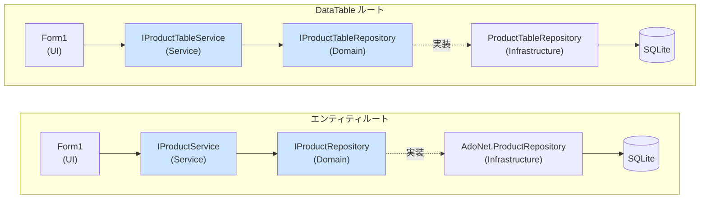

# アーキテクチャ解説：エンティティルートと DataTable ルートの依存関係

`App.WinForms.ManualDI` には2つのデータアクセスルートが並列で存在するが、
現在は **どちらもオニオンアーキテクチャの依存ルールに従っている**。

過去の経緯（DataTable ルートが Service / Domain を迂回していた時期の記録）は
[ARCHITECTURE_NOTES_old.md](ARCHITECTURE_NOTES_old.md) を参照。

---

## 依存関係（現状）

- どちらのルートも UI → Service → Domain（インターフェース） → Infrastructure（実装）の方向で依存している
- `Form1` は `IProductService` と `IProductTableService` のみを知り、Infrastructure の型を直接参照しない
- `IProductTableRepository` は `CSBestpPactice.Domain/Repositories/` に置かれている

---

## 何が変わったか

以前は `IProductTableRepository` が Infrastructure に置かれ、`Form1` が直接これを受け取っていた
（UI → Infrastructure の直接依存）。これを以下の手順で修正した。

1. `IProductTableRepository` を `CSBestpPactice.Infrastructure` から `CSBestpPactice.Domain.Repositories` へ移動
2. Service 層に `IProductTableService` / `ProductTableService` を新設し、`IProductTableRepository` をラップ
3. `Program.cs` の DI 組み立てを `ProductTableRepository → ProductTableService → Form1` の順に変更
4. `Form1` のコンストラクターを `IProductTableRepository` 受け取りから `IProductTableService` 受け取りに変更

---

## 2つのルートの違い（依存方向は同じだが目的が異なる）

依存方向が揃った一方で、各層が扱うデータの性質は今も異なる。

| 項目 | エンティティルート | DataTable ルート |
|---|---|---|
| Service が扱う型 | `Product`（Domain エンティティ） | `DataTable`（ADO.NET の表形式データ） |
| Service の役割 | `Product` に対する業務ロジック・変換 | Repository への薄い委譲（ロジックなし） |
| 変更検知 | なし（エンティティ単位で都度 Add/Update/Delete） | `DataRow.RowState` + `GetChanges()`（DataAdapter 相当のバッチ更新） |
| UI バインディング | `List<Product>` をそのまま bind | `DataTable` をそのまま bind（DataGridView 編集 → RowState） |

`IProductTableService` が `Product` を変換せず素通しなのは、DataTable が UI 都合の表形式データであり、
そもそも Domain エンティティへ写すべき情報ではないため。依存ルールは守るが、
DataAdapter パターンの「生データをそのまま流す」性質はそのまま残している。
