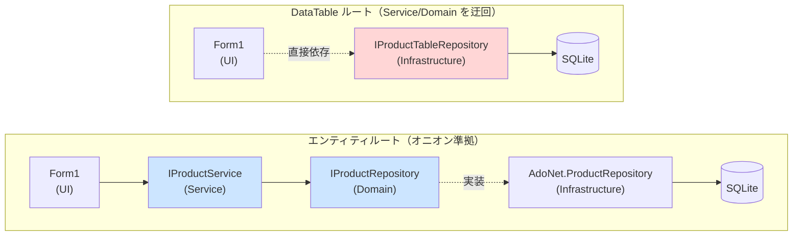
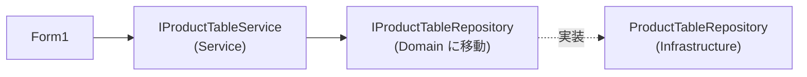

# アーキテクチャ上の妥協点：DataTable ルートが Service / Domain を迂回する理由

`App.WinForms.ManualDI` には2つのデータアクセスルートが並列で存在する。
エンティティルートはオニオンアーキテクチャの依存ルールに従うが、DataTable ルートは
**意図的にこのルールを破っている**。その理由と影響をここに記録する。

---

## 依存関係の比較

- 青：オニオンアーキテクチャの依存方向を守っている（UI → Service → Domain → Infrastructure 実装）
- 赤：UI が Infrastructure を直接参照している（依存ルール違反）

`IProductTableRepository` は `CSBestpPactice.Infrastructure/Repositories/DataTables/` に置かれており、
Domain ではない。`Form1` のコンストラクターはこれを直接受け取るため、
README に明記した「UI は Service / Domain のインターフェースしか知らない」という原則に反する。

---

## なぜこうなっているか

1. **Service 層の役割は Domain エンティティ（`Product`）に対する業務ロジック**
   `IProductService` のメソッドはすべて `Product` を入出力に使う。DataTable は `Product` に
   一切マッピングされない「生の表形式データ」であり、Service が変換すべき対象がそもそも存在しない。

2. **DataTable 自体が UI 向けデータ構造になっている**
   DataGridView にそのまま bind できる形式を Repository が直接返しており、
   Service が「ビジネスロジックを足す」前にすでに UI 都合のデータになっている。

---

## 厳密にオニオンアーキテクチャへ従う場合

`IProductTableRepository` を Domain に移し、`IProductTableService` を Service 層に追加すれば
依存ルールは守れる。しかし DataTable は本質的に「DB の生データ表現」であり、
Domain が知るべき抽象とは言いがたいため、このプロジェクトでは **意図的にスキップしている**。

---

## 結論

DataTable ルートの Service/Domain 迂回は設計ミスではなく、
DataAdapter パターンを再現する上での **意図的な妥協**。
DataTable ルートを「教科書的なオニオンアーキテクチャの例」として読まないこと。
